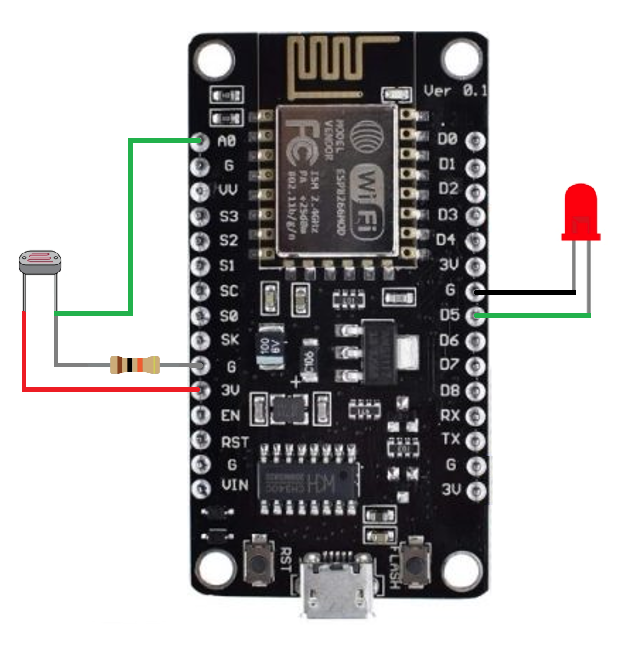

# NodeMCU – App Inventor – HiveMQ Akıllı Aydınlatma Projesi

<table>
<tr>
<td style="vertical-align: top; padding-left: 20px;">
<p>Bu proje; <strong>NodeMCU</strong>, <strong>LDR</strong> sensörü, <strong>LED lamba</strong>, 
<strong>HiveMQ MQTT brokeri</strong> ve <strong>App Inventor Android uygulaması</strong> kullanılarak oluşturulmuş bir IoT uygulamasıdır.</p>
<ul style="margin-left:16px; list-style-type: disc;">
<li>Sensörden okunan <strong>ışık şiddeti verileri</strong> HiveMQ’ya gönderilir.</li>
<li>App Inventor uygulaması bu değeri <strong>canlı olarak</strong> takip eder.</li>
<li><strong>Lamba ikonuna basıldığında</strong>, MQTT üzerinden NodeMCU’ya komut gönderilir ve LED açılır/kapanır.</li>
</ul>
</td>
<td>

</td>
<td>

</td>
</tr>
</table>

## 🚀 Özellikler

* Gerçek zamanlı MQTT haberleşmesi
* LDR sensör verisi izleme
* Mobil uygulamadan LED kontrolü
* HiveMQ Cloud ile güvenli bağlantı
* Tam açık kaynak kod

## 📘 Detaylı Belgelendirme

Aşağıdaki teknik dokümanlarla proje adım adım açıklanmıştır:

| Bölüm                            | Açıklama                                | Dosya                                   |
| -------------------------------- | --------------------------------------- | --------------------------------------- |
| Donanım ve devre şeması          | LDR + LED + NodeMCU bağlantıları        | [hardware.md](./docs/hardware.md)       |
| Arduino/ESP8266 MQTT kodları     | Kodlar + satır satır açıklama           | [arduino.md](./docs/arduino.md)         |
| App Inventor arayüz & bloklar    | Tasarım + block ekranı                  | [appinventor.md](./docs/appinventor.md) |
| HiveMQ kurulum rehberi           | Üyelik, cluster, credential, web client | [hivemq.md](./docs/hivemq.md)           |
| Mobil uygulama ekran görüntüleri | Açma-kapama, sensör verisi, video       | [mobileapp.md](./docs/mobileapp.md)     |

## 🎥 Demo Videosu

🟡 Video: Mobil uygulama üzerinden LED aç/kapa + canlı sensör verisi
(YouTube linki ekleyebilirsiniz)

## 📦 Proje Klasör Yapısı

```
/docs/*.md          → Ayrıntılı anlatımlar
/assets/...         → Tüm görseller
/src/               → Arduino/ESP8266 kodları
/app/               → App Inventor .aia dosyası
```