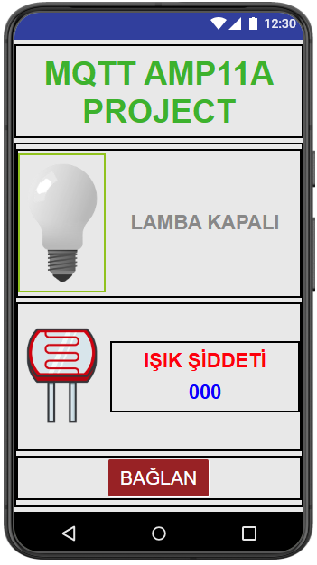
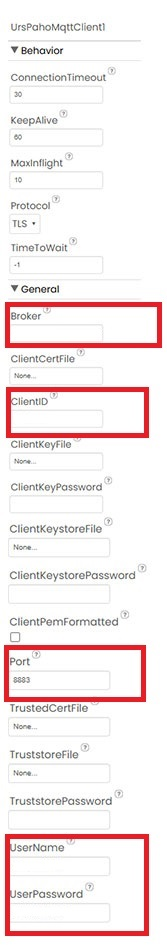
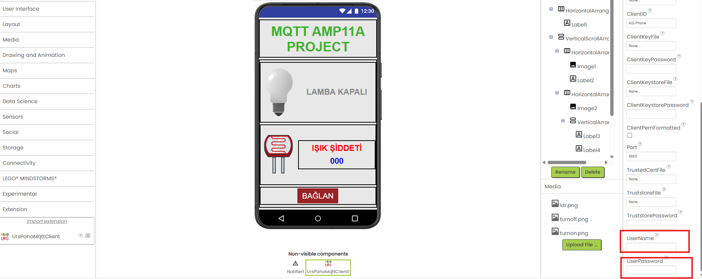
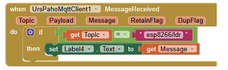
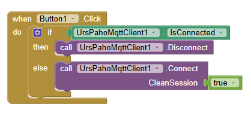

# App Inventor – Tasarım ve Blok Kodlama

Bu doküman App Inventor içinde yapılan tasarım ve blok yapısını açıklar.

## 🟦 1) Arayüz Tasarımı

<table>
<tr>
<td>

<strong>Ekranda bulunan bileşenler:</strong>
<ul>
<li>MQTT AMP11A PROJECT yazan başlığını gösteren etiket <strong>(Label1)</strong></li>
<li>Lamba resmi <strong>(Image1)</strong></li>
<li>LAMBA KAPALI / LAMBA AÇIK  değerlerini gösteren etiket <strong>(Label2)</strong></li>
<li>LDR resmi <strong>(Image2)</strong></li>
<li>IŞIK ŞİDDETİ başlığını gösteren etiket <strong>(Label3)</strong></li>
<li>LDR değerini gösteren etiket <strong>(Label4)</strong></li>
<li>Bağlan / Bağlantıyı Kes butonu <strong>(Button1)</strong></li>
<li>MQTT Client komponenti <strong>(UrsPahoMqttClient1)</strong></li>
<li>Uyarılar göstermek için Notifier komponenti <strong>(Notifier1)</strong></li>
<li><strong>(Son 2 komponent görselde gözükmemektedir, gizlidir.)</strong></li>
</ul>
</td>
<td>

<strong>📷 Görsel:</strong> 

</td>
</tr>
</table>

## 🟦 2) Blok Kodlama

### MQTT Bağlantısı

<table width="953">
<tr>
<td>
<strong>MQTT Bağlantısı (UrsPahoMqttClient1 özellikleri doldurulacaktır)</strong>
<ul>
<li>Sunucu adresi → HiveMQ cluster host <strong>Broker :</strong> ****************************.s1.eu.hivemq.cloud</li>
<li>ClientID → Rastgele(random) bir isim verilebilir. <strong>ClientID :</strong> AI2-Phone</li>
<li>Port(TLS) → 8883 <strong>Port :</strong> 8883</li>
<li>Kullanıcı adı → oluşturulan credential username <strong>UserName :</strong> ****************</li>
<li>Şifre → credential userpassword <strong>UserPassword :</strong> ****************</li>
</ul>
</td>
<td>
<strong>📷 Görsel 1:</strong> 

</td>
</tr>
</table>

<table>
<tr>
<td>
<strong>📷 Görsel 2:</strong> 

</td>
</tr>
<tr>
<td>
<strong>📷 Görsel 3:</strong> 

</td>
</tr>
</table>

### LDR Değerini Dinleme

`esp8266/ldr` subscribe edilir.
Gelen değer Label içinde güncellenir.

### Lamba Kontrolü

Image tıklandığında:

- Eğer kapalı → `"ON"` publish edilir
- Eğer açık → `"OFF"` publish edilir

📷 Blok görselleri:

