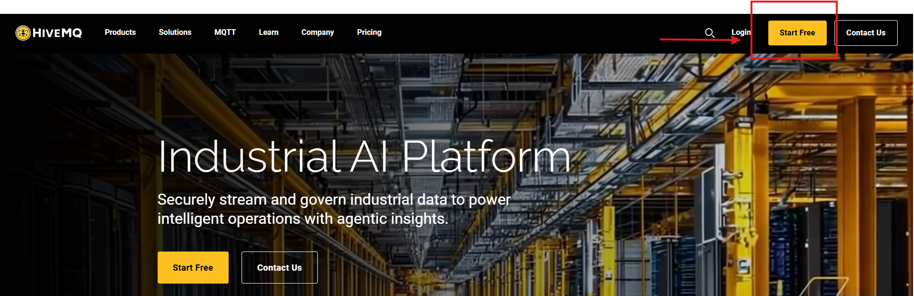
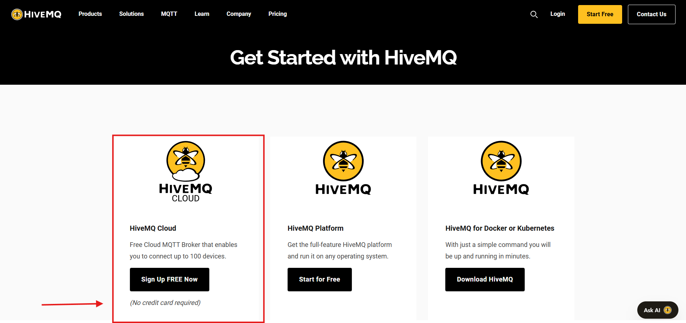
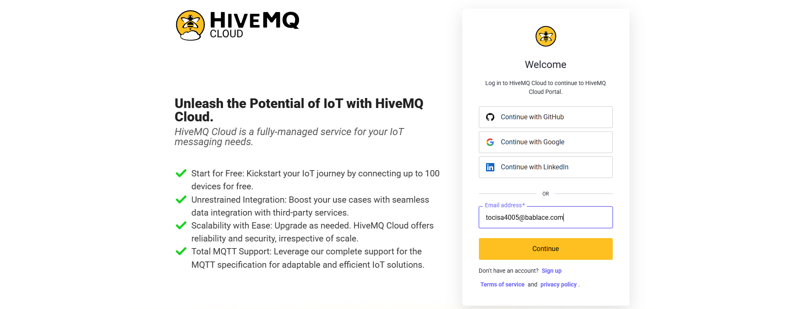
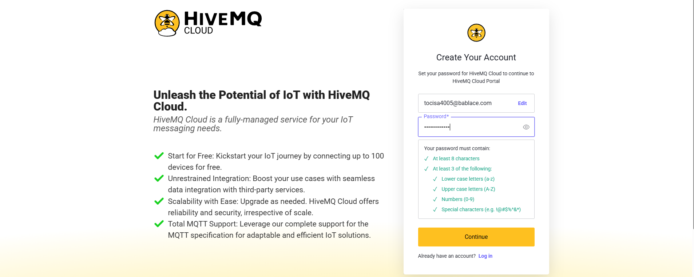
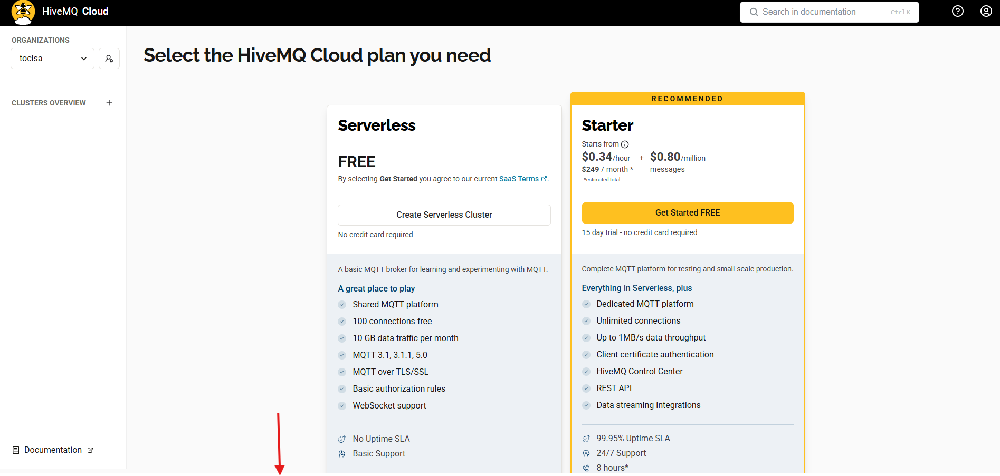
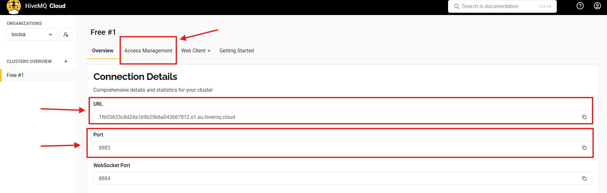
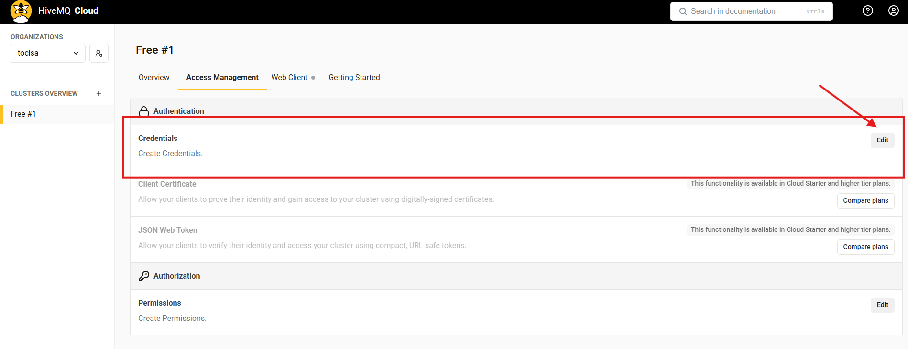
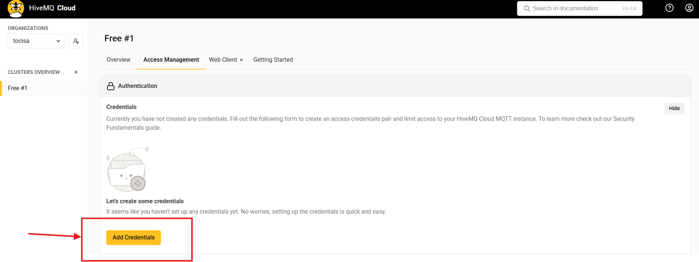
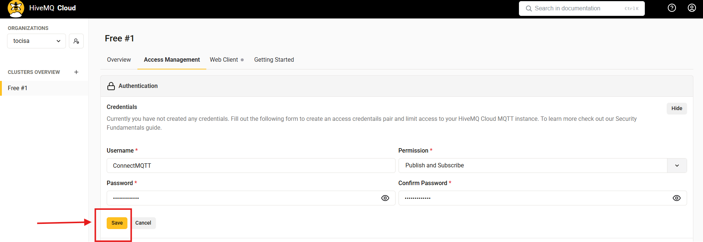
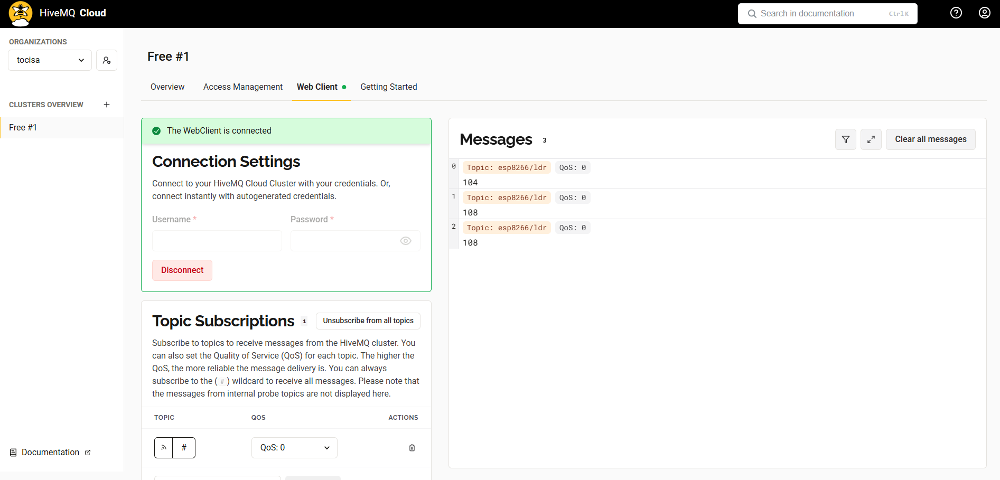

# HiveMQ Cloud – Adım Adım Kurulum ve Kullanım Rehberi

Bu rehber, HiveMQ Cloud üzerinde ücretsiz bir MQTT broker oluşturma, erişim yönetimi (Access Management), kullanıcı adı/şifre (Credentials) oluşturma ve WebClient üzerinden bağlanarak topic mesajlarını dinleme işlemlerini anlatır.

Her adım, oluşturduğunuz ekran görüntüleriyle birebir uyumludur.

---

## 1. HiveMQ Cloud’a Kayıt Olma

### **1.1. Anasayfa – Start Free**
HiveMQ Cloud ana sayfasında **Start Free** butonuna basın.  

### **1.2. Get Started – Sign Up Free Now**
Açılan sayfada **Sign Up Free Now** butonuna tıklayın.  

### **1.3. E-posta Adresi Girme**
E-posta adresinizi yazıp **Continue** butonuna tıklayın.  

### **1.4. Hesap Şifresi Oluşturma**
Karşınıza gelen “Create your account” ekranında şifrenizi belirleyip **Continue** butonuna basın.  

### **1.5. E-posta Doğrulama Uyarısı**
HiveMQ, e-posta adresinize gönderilen doğrulama mesajını onaylamanızı ister.  

### **1.6. Mail Üzerinden Hesap Doğrulama**
E-posta kutunuza gelen mesajdaki **Confirm my Account** butonuna tıklayın.  

---

## 2. İlk Bilgilerin Girilmesi

### **2.1. Kullanıcı Bilgileri Formu**
Ad, soyad, job title ve company bilgilerinizi girerek **Continue** butonuna basın.  

### **2.2. Plan Seçimi Ekranı**
“Select the HiveMQ Cloud Plan you need” ekranı açılır; aşağıya kaydırarak Serverless bölümüne ulaşın.  

---

## 3. Serverless Cluster Oluşturma

### **3.1. Create Serverless Cluster**
“Compare Features” bölümünde **Serverless** planı altında **Create Serverless Cluster** butonuna tıklayın.  

### **3.2. Cluster Oluşturuldu – Yönetim Paneli**
Cluster oluşturulduktan sonra “Your Clusters” ekranında **Manage Cluster** butonu görünür.  

---

## 4. Cluster Bilgileri ve Access Management

### **4.1. Broker Bilgilerini Not Alma**
Cluster panelinde:

- Broker URL  
- TLS Port  

bilgilerini not edin ve **Access Management** sekmesine geçin.  

---

## 5. Authentication → Credentials Oluşturma

### **5.1. Authentication Ekranı**
Access Management bölümünde **Authentication** sekmesine girip **Edit** butonuna basın.  

### **5.2. Add Credentials**
Açılan pencerede **Add Credentials** butonuna tıklayın.  

### **5.3. Kullanıcı Bilgilerini Doldurma**
Açılan formda:

- Username  
- Password  
- Confirm Password  
- Permissions: **Publish & Subscribe**

bilgilerini doldurun ve **Save** butonuna basın.  

### **5.4. Hesap Oluşturuldu**
Credentials başarıyla oluşturuldu. Şimdi **WebClient** sekmesine geçin.  

---

## 6. WebClient ile MQTT Bağlantısı

### **6.1. Connection Settings**
WebClient bölümünde oluşturduğunuz username ve password bilgilerini girip **Connect** butonuna basın.  

### **6.2. Bağlantı Başarılı – Mesajlara Abone Olma**
Bağlantı başarılı olduğunda WebClient “Connected” yazar.  
**Subscribe to all messages** seçeneğini aktif edin.  

### **6.3. Topic Mesajlarının Görüntülenmesi**
ESP8266 gibi bir cihazdan gönderilen mesajlar artık WebClient üzerinde görünür. Örnek:

- Topic: `esp8266/ldr`
- QoS: 0  
- İçerik: ışık şiddeti değerleri  

