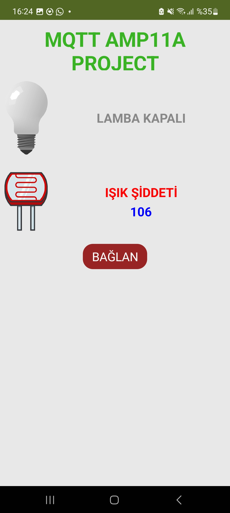
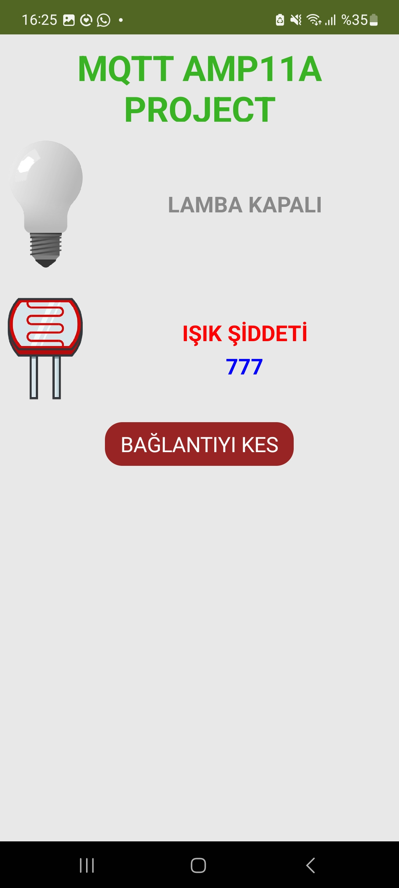

# Mobil Uygulama – Ekran Görüntüleri ve Video

Bu dosya, App Inventor ile oluşturulan mobil uygulamanın çalışma görüntülerini içerir.

## 🟦 1) LED Durum Görselleri

* Gri ampul → LED kapalı
* Sarı ampul → LED açık

📷 Görseller:

<div style="display:flex; gap:10px;">
    
    
</div>


## 🟦 2) LDR Sensör Verisi

Uygulama içinde canlı olarak güncellenir.
Örnek:

```
Işık Şiddeti: 412
```

📷 Görsel:

<div style="display:flex; gap:10px;">
    
    
    
</div>

## 🟦 3) Uygulama Videosu

## 🎥 Uygulama Videosu


Video açıklaması:

* Lamba ikonuna tıklayınca LED yanıyor/sönüyor
* Ekrandaki sensör değeri gerçek zamanlı değişiyor

## 🟦 4) Tam Uygulama Akışı

1. Uygulama açılır → MQTT’ye bağlanır
2. LDR değerleri akar
3. Lamba ikonuna basılır → LED değişir
4. HiveMQ üzerinden tüm iletişim canlı gerçekleşir
